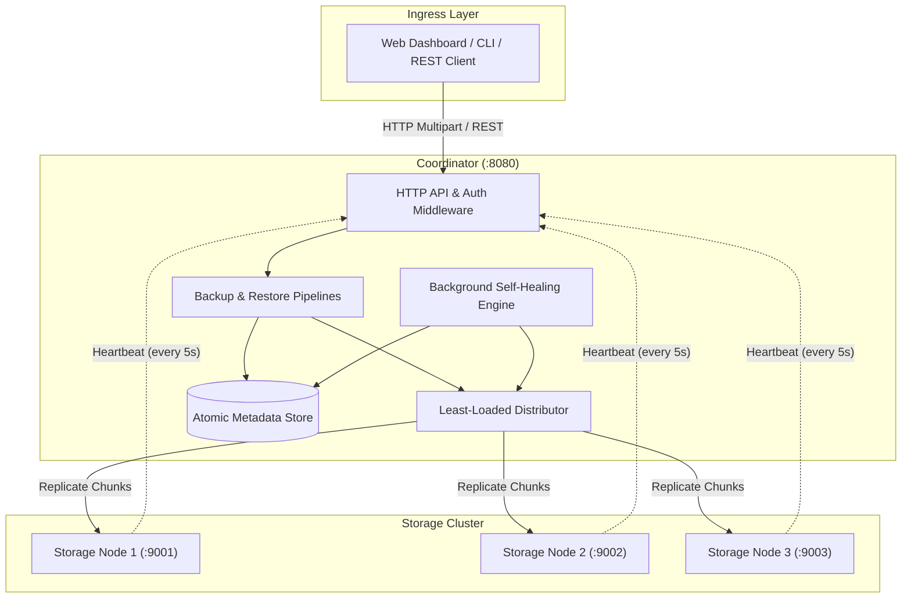
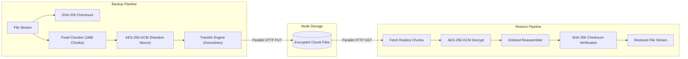

# fudou

a fast, zero-dependency distributed backup system and storage cluster built from scratch in go. files are sliced into streams, encrypted client-side with aes-256-gcm, and scattered across independent storage nodes with 3x replication. if a node drops offline, fudou detects the heartbeat loss and heals the cluster automatically.

---

## contents

- [features](#features)
- [architecture](#architecture)
- [technologies and stack](#technologies-and-stack)
- [live cluster dashboard and web ui](#live-cluster-dashboard-and-web-ui)
  - [dashboard capabilities](#dashboard-capabilities)
  - [how to run the web dashboard](#how-to-run-the-web-dashboard)
  - [using the web dashboard](#using-the-web-dashboard)
- [quickstart and cli reference](#quickstart-and-cli-reference)
  - [1. build binaries from source](#1-build-binaries-from-source)
  - [2. run the coordinator service](#2-run-the-coordinator-service)
  - [3. run storage node daemons](#3-run-storage-node-daemons)
  - [4. launch multi-node cluster with docker compose](#4-launch-multi-node-cluster-with-docker-compose)
  - [5. environment variables and configuration reference](#5-environment-variables-and-configuration-reference)
- [api reference and curl examples](#api-reference-and-curl-examples)
  - [generate authentication token](#generate-authentication-token)
  - [upload and backup a file](#upload-and-backup-a-file)
  - [list stored files](#list-stored-files)
  - [download and restore a file](#download-and-restore-a-file)
  - [delete a file](#delete-a-file)
  - [query cluster topology and telemetry](#query-cluster-topology-and-telemetry)
  - [query aggregate cluster metrics](#query-aggregate-cluster-metrics)
- [project structure](#project-structure)
- [how distributed backup works in fudou](#how-distributed-backup-works-in-fudou)
  - [stream chunking and segmentation](#stream-chunking-and-segmentation)
  - [aes-256-gcm authenticated encryption](#aes-256-gcm-authenticated-encryption)
  - [least-loaded n-way replication](#least-loaded-n-way-replication)
  - [automated self-healing engine](#automated-self-healing-engine)
- [testing](#testing)
- [license](#license)

---

## features

- zero external dependencies in the backend: built entirely on the go standard library with net/http, crypto/aes, crypto/cipher, crypto/sha256, and sync primitives.
- stream-based fixed chunking: files are segmented into fixed 1MB chunks on the fly without buffering entire files in memory, keeping ram usage low regardless of file size.
- zero-knowledge client encryption: every file upload generates a unique 256-bit encryption key and 96-bit nonces per chunk with aes-256-gcm. the server never holds your raw plaintext or unencrypted chunks.
- sha-256 checksum verification: cryptographic digests are computed on raw streams before chunking and re-verified byte-by-byte upon restore to catch silent data corruption or tampering.
- n-way replication: every chunk is copied across multiple storage nodes (3x by default) using a least-loaded placement strategy that prioritizes nodes with the most free capacity.
- self-healing cluster: a background worker audits chunk replicas every 10 seconds. if a storage node stops sending heartbeats, missing chunks are automatically re-replicated to healthy nodes.
- independent storage daemons: nodes run as standalone http services with isolated disk directories, atomic writes, and periodic heartbeat beacons.
- hmac-sha256 token authentication: signed bearer tokens protect api endpoints and allow role-based authorization.
- modern web dashboard: built with next.js 15, react 19, and typescript, giving you live node health visualization, cluster disk usage meters, drag-and-drop uploads, and key-based restore modals.
- docker compose ready: launch the coordinator and 3 storage nodes in containers with a single command.

---

## architecture

fudou splits work between a central coordinator and an arbitrary number of lightweight storage nodes. the coordinator handles client traffic, metadata tracking, encryption, and cluster balancing, while nodes simply store and serve encrypted chunk files.



### data flow lifecycle

the diagrams below outline how raw data moves from upload through encrypted storage to verified restore.



---

## technologies and stack

- backend: go 1.24+ (standard library only: net/http, crypto/aes, crypto/cipher, crypto/rand, crypto/sha256, crypto/hmac, sync, os, io)
- frontend: next.js 15, react 19, typescript, lucide-react, vanilla css tokens
- storage engine: content-addressable local disk storage with atomic write operations
- containers: docker, docker compose
- build tool: gnu make

---

## live cluster dashboard and web ui

the web dashboard gives you complete visibility into the storage cluster, lets you manage file backups, and handles client-side decryption key entry for restoring files.

### dashboard capabilities

- cluster metrics: tracks total backed-up files, total raw bytes stored, aggregated disk capacity across all active nodes, and replication status.
- node topology: visual cards for each storage node showing network address, online/offline status, used disk space, and total storage limits.
- drag-and-drop uploads: drop any file into the browser to trigger stream chunking, encryption, and multi-node distribution.
- zero-knowledge key modal: immediately after upload, the ui generates and presents your 64-character hex master key. you keep this key to decrypt your file later.
- file catalog: inspect stored files, original file names, mime types, sizes, sha-256 checksums, and chunk counts.
- authenticated download: click restore on any file, enter the matching 64-character hex key, and stream the decrypted file straight to your machine.
- cascading deletion: removing a file purges metadata from the coordinator and cascades deletion calls to purge chunks across all storage nodes.

### how to run the web dashboard

```bash
cd web
npm install
npm run dev
```

open your browser and visit `http://localhost:3000`.

if your coordinator runs on a custom port or remote server, point the dashboard to it with an environment variable:

```bash
NEXT_PUBLIC_COORDINATOR_URL=http://localhost:8080 npm run dev
```

### using the web dashboard

1. open `http://localhost:3000/dashboard` to access the main file manager.
2. drag a file into the upload zone or click to browse.
3. when the upload finishes, copy the 64-character hex key shown in the dialog. store this somewhere safe because the coordinator does not keep this key.
4. to restore, click the download button next to the file and paste your key. fudou verifies the sha-256 hash before handing you the file.
5. visit `http://localhost:3000/admin` to see live node heartbeat signals, node capacities, and cluster-wide metrics.

---

## quickstart and cli reference

### 1. build binaries from source

compile the coordinator and node daemons using the makefile:

```bash
make build
```

or build directly with go:

```bash
go build -o bin/coordinator ./cmd/coordinator
go build -o bin/node ./cmd/node
```

### 2. run the coordinator service

start the coordinator with default settings on port 8080:

```bash
make run-coordinator
```

or run with custom environment variables:

```bash
PORT=8080 REPLICATION_FACTOR=3 METADATA_PATH=./data/coordinator/meta.json AUTH_SECRET=dev-secret go run ./cmd/coordinator
```

### 3. run storage node daemons

open three separate terminal tabs to run three isolated storage nodes:

```bash
make run-node1
```

```bash
make run-node2
```

```bash
make run-node3
```

or start them manually with distinct ports and data folders:

```bash
NODE_ID=node-1 PORT=9001 STORAGE_DIR=./data/node1 COORDINATOR_URL=http://localhost:8080 go run ./cmd/node
NODE_ID=node-2 PORT=9002 STORAGE_DIR=./data/node2 COORDINATOR_URL=http://localhost:8080 go run ./cmd/node
NODE_ID=node-3 PORT=9003 STORAGE_DIR=./data/node3 COORDINATOR_URL=http://localhost:8080 go run ./cmd/node
```

nodes automatically register with the coordinator on startup and send heartbeats every 5 seconds.

### 4. launch multi-node cluster with docker compose

to spin up the entire setup (coordinator plus three storage nodes) in isolated containers:

```bash
make docker-up
```

or with docker compose:

```bash
docker compose -f deploy/docker-compose.yml up --build
```

to shut down the cluster and clean up containers:

```bash
make docker-down
```

### 5. environment variables and configuration reference

#### coordinator options

| variable | type | default | description |
| :--- | :--- | :--- | :--- |
| `PORT` | integer | `8080` | tcp port for the coordinator http server |
| `REPLICATION_FACTOR` | integer | `3` | number of healthy storage nodes to replicate each chunk to |
| `METADATA_PATH` | string | `./data/metadata.json` | file path for the atomic persistent json metadata store |
| `AUTH_SECRET` | string | `default-fudou-secret-key-change-me` | hmac secret used to sign and verify api tokens |

#### storage node options

| variable | type | default | description |
| :--- | :--- | :--- | :--- |
| `NODE_ID` | string | `node-<timestamp>` | unique identifier for the storage node daemon |
| `PORT` | integer | `9001` | tcp port for the storage node daemon http server |
| `STORAGE_DIR` | string | `./data/chunks` | local filesystem directory for storing encrypted chunks |
| `COORDINATOR_URL` | string | `http://localhost:8080` | base url of the active coordinator instance |
| `HEARTBEAT_SEC` | integer | `5` | interval in seconds between outbound heartbeat signals |

#### web dashboard options

| variable | type | default | description |
| :--- | :--- | :--- | :--- |
| `NEXT_PUBLIC_COORDINATOR_URL` | string | `http://localhost:8080` | target coordinator url for browser api requests |

---

## api reference and curl examples

### generate authentication token

```bash
curl -X POST http://localhost:8080/api/auth/token \
  -H "Content-Type: application/json" \
  -d '{"user_id": "user-001", "role": "admin"}'
```

sample response:

```json
{
  "role": "admin",
  "token": "d98a21f7c3...",
  "user_id": "user-001"
}
```

### upload and backup a file

```bash
curl -X POST http://localhost:8080/api/files \
  -F "file=@document.pdf" \
  -F "user_id=user-001"
```

sample response:

```json
{
  "FileID": "3fa85f64-5717-4562-b3fc-2c963f66afa6",
  "Filename": "document.pdf",
  "TotalSize": 2097152,
  "Checksum": "e3b0c44298fc1c149afbf4c8996fb92427ae41e4649b934ca495991b7852b855",
  "ChunkCount": 2,
  "KeyHex": "a1b2c3d4e5f60718293a4b5c6d7e8f90123456789abcdef0123456789abcdef0"
}
```

### list stored files

```bash
curl -X GET "http://localhost:8080/api/files?user_id=user-001"
```

sample response:

```json
[
  {
    "id": "3fa85f64-5717-4562-b3fc-2c963f66afa6",
    "user_id": "user-001",
    "filename": "document.pdf",
    "mime_type": "application/pdf",
    "size": 2097152,
    "checksum": "e3b0c44298fc1c149afbf4c8996fb92427ae41e4649b934ca495991b7852b855",
    "chunk_count": 2,
    "created_at": "2026-09-14T10:00:00Z",
    "updated_at": "2026-09-14T10:00:00Z"
  }
]
```

### download and restore a file

pass the file id and the 64-character hex key in query parameters to stream the decrypted payload:

```bash
curl -X GET "http://localhost:8080/api/files/3fa85f64-5717-4562-b3fc-2c963f66afa6/download?key=a1b2c3d4e5f60718293a4b5c6d7e8f90123456789abcdef0123456789abcdef0" \
  --output restored_document.pdf
```

### delete a file

```bash
curl -X DELETE http://localhost:8080/api/files/3fa85f64-5717-4562-b3fc-2c963f66afa6
```

### query cluster topology and telemetry

```bash
curl -X GET http://localhost:8080/api/admin/nodes
```

sample response:

```json
[
  {
    "id": "node-1",
    "address": "http://localhost:9001",
    "status": "online",
    "capacity": 10737418240,
    "used_bytes": 2097152,
    "last_seen": "2026-09-14T10:05:00Z"
  }
]
```

### query aggregate cluster metrics

```bash
curl -X GET http://localhost:8080/api/admin/metrics
```

sample response:

```json
{
  "total_files": 12,
  "total_bytes": 45097152,
  "total_capacity": 32212254720,
  "total_used": 135291456,
  "active_nodes": 3,
  "replication_factor": 3
}
```

---

## project structure

```text
fudou/
├── cmd/
│   ├── coordinator/
│   │   └── main.go               coordinator server entry point
│   └── node/
│       └── main.go               storage node daemon entry point
├── deploy/
│   ├── coordinator.Dockerfile    multi-stage alpine container for coordinator
│   ├── node.Dockerfile           multi-stage alpine container for storage node
│   └── docker-compose.yml        multi-node cluster orchestration
├── internal/
│   ├── api/
│   │   ├── handlers.go           http api endpoints for backup, restore, nodes, auth
│   │   ├── handlers_test.go      comprehensive api integration test suite
│   │   ├── metrics.go            cluster telemetry aggregation structures
│   │   └── middleware.go         cors headers and request access logging
│   ├── auth/
│   │   ├── auth.go               hmac-sha256 token generation and validation
│   │   └── auth_test.go          token tamper resistance and expiry tests
│   ├── chunker/
│   │   ├── chunker.go            chunk and chunker interface definitions
│   │   ├── fixed_chunker.go      fixed-size stream chunk segmentation engine
│   │   ├── fixed_chunker_test.go boundary, empty, and large stream tests
│   │   ├── reassembler.go        ordered chunk reassembly and integrity pipeline
│   │   └── reassembler_test.go   out-of-order and partial chunk reassembly tests
│   ├── config/
│   │   └── config.go             default parameters and environment loaders
│   ├── coordinator/
│   │   ├── backup.go             distributed backup coordination pipeline
│   │   ├── backup_test.go        end-to-end backup pipeline verification
│   │   ├── delete.go             distributed chunk deletion engine
│   │   ├── distributor.go        least-loaded node placement algorithm
│   │   ├── distributor_test.go   distribution and allocation tests
│   │   ├── healing.go            background self-healing and replication engine
│   │   ├── healing_test.go       node dropout detection and rebalancing tests
│   │   ├── node_client.go        http client for node chunk operations
│   │   ├── restore.go            distributed restore pipeline and verification
│   │   ├── restore_test.go       end-to-end restore pipeline verification
│   │   ├── transfer.go           concurrent chunk transfer engine
│   │   └── transfer_test.go      parallel chunk transfer and error handling tests
│   ├── crypto/
│   │   ├── aes_gcm.go            aes-256-gcm authenticated encryption and decryption
│   │   ├── aes_gcm_test.go       ciphertext verification and tamper failure tests
│   │   ├── crypto.go             encryptor and hasher interface contracts
│   │   ├── hasher.go             sha-256 stream hasher implementation
│   │   ├── hasher_test.go        stream checksum validation tests
│   │   ├── keys.go               secure 256-bit key and 96-bit nonce generators
│   │   └── keys_test.go          entropy and uniqueness tests
│   ├── metadata/
│   │   ├── file_store.go         atomic json metadata persistence implementation
│   │   ├── file_store_test.go    concurrent read/write and crash safety tests
│   │   ├── memory_store.go       in-memory thread-safe metadata store
│   │   ├── memory_store_test.go  metadata crud operations test suite
│   │   └── store.go              store interface and domain record definitions
│   └── node/
│       ├── disk_store.go         local disk storage engine with atomic writes
│       ├── disk_store_test.go    disk store io and quota boundary tests
│       ├── handler.go            http handlers for chunk store, read, delete
│       ├── handler_test.go       node http handler verification tests
│       ├── heartbeat.go          outbound heartbeat beacon service
│       ├── heartbeat_test.go     heartbeat interval and payload tests
│       ├── server.go             storage node daemon lifecycle and router
│       ├── server_test.go        graceful startup and shutdown tests
│       └── store.go              node storage interface definition
├── web/
│   ├── app/
│   │   ├── admin/
│   │   │   └── page.tsx          cluster topology, node inspection, and telemetry
│   │   ├── dashboard/
│   │   │   └── page.tsx          file upload, key display modal, and file catalog
│   │   ├── globals.css           sleek dark mode styling and typography
│   │   ├── layout.tsx            root next.js layout wrapper
│   │   └── page.tsx              landing page with architecture overview
│   ├── components/
│   │   ├── ClusterTopology.tsx   node cards with live health indicators and quotas
│   │   ├── FileList.tsx          file table with delete and restore actions
│   │   ├── FileUpload.tsx        drag-and-drop file upload zone
│   │   ├── Navbar.tsx            top navigation bar with live status indicators
│   │   ├── RestoreModal.tsx      decryption key prompt modal for downloads
│   │   └── StorageStats.tsx      metrics cards for total storage and nodes
│   ├── context/
│   │   └── AuthContext.tsx       react auth state and session token provider
│   ├── lib/
│   │   └── api.ts                type-safe api client methods for web frontend
│   ├── package.json              next.js, react, and dependencies manifest
│   └── tsconfig.json             typescript compiler configuration
├── go.mod                        go module definition
└── Makefile                      automation recipes for build, test, and run
```

---

## how distributed backup works in fudou

### stream chunking and segmentation

fudou never loads whole files into ram. the `FixedChunker` reads incoming `io.Reader` streams in 1MB chunks (1,048,576 bytes). each chunk gets a deterministic sequence index, byte length, and unique identifier. if an upload fails halfway through, only unfinished chunks need retrying.

### aes-256-gcm authenticated encryption

chunks are encrypted before they ever leave the coordinator:

1. a fresh 256-bit key is generated for every uploaded file using `crypto/rand`.
2. each chunk gets its own 96-bit (12-byte) initialization vector (nonce).
3. the chunk payload is encrypted and sealed with an authenticated 128-bit tag. the nonce is attached to the ciphertext chunk so the chunk is self-contained when decrypted with the master key.
4. storage nodes receive and store only ciphertext. they never see original filenames, metadata, or unencrypted contents.

### least-loaded n-way replication

the coordinator constantly tracks how much disk space each node has used via heartbeats:

1. when a chunk is ready for placement, the `Distributor` sorts active, healthy storage nodes by `used_bytes` in ascending order.
2. the top `N` nodes (where `N` is `REPLICATION_FACTOR`, default 3) are chosen to receive the chunk.
3. the `ChunkTransferEngine` pushes the chunk across all selected nodes concurrently using goroutines.
4. if a target node rejects the chunk or times out, the transfer falls over to the next healthiest candidate.

### automated self-healing engine

hardware failures happen. fudou fixes under-replicated data in the background:

1. storage nodes post a heartbeat to `/api/nodes/heartbeat` every 5 seconds with their current byte count and status.
2. the coordinator logs the last-seen time of every node.
3. a self-healing worker runs every 10 seconds. if a node misses heartbeats for more than 15 seconds, it is flagged as offline.
4. the worker reviews all chunk mappings. any chunk that lived on the dead node now has fewer than the required replicas.
5. fudou grabs the missing chunk from a surviving healthy replica node and sends a fresh copy to another active node.
6. the coordinator updates the metadata store atomically so the new node is officially registered as a replica holder.

---

## testing

the test suite covers unit tests and integration pipelines across all internal packages: crypto roundtrips, chunk boundary conditions, out-of-order reassembly, concurrent transfers, heartbeat beaconing, and self-healing.

to run all tests:

```bash
make test
```

or run directly with the race detector enabled:

```bash
go test -v -race ./...
```

---

## license

mit license. see `LICENSE` or repository headers for copyright terms.
